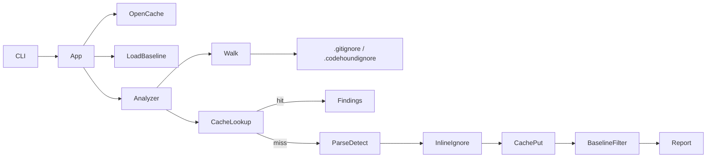

## Summary

Implements Phase 10 incremental analysis cache, inline/file ignore directives, baseline filtering, and minimal `.gitignore` / `.codehoundignore` walk support. Warm cache hits skip parse+detect; CLI wires `--no-cache`, `--cache-dir`, `--rebuild-cache`, and `--prune-cache` without changing default scan behaviour beyond enabling the cache when writable.

---

## Motivation / context

- Plans: `plans/port-phasewise-checklist.md` (Phase 10), `plans/architecture-go.md`, `plans/parity-matrix.md`
- Issues: see **Related issues**
- Rust parity: `codehound/src/engine/{cache,baseline,ignore}` + walk ignore filters

---

## Changes

### Incremental cache (`internal/engine/cache`)

- On-disk layout: `.codehound-cache/manifest.json` + `files/<sha256(path)>.json`
- Invalidation: content SHA-256, tool version mass-stale, rule-config fingerprint (`ScanContext.RuleConfigFingerprint`)
- Warm hit path in `Analyzer.scanOne` skips parse+detect
- Size-based eviction on flush (default max 500 MiB via app open)
- In-memory store for unit tests

### Ignore (`internal/engine/ignore`)

- Comment-only directives: `// codehound-ignore: RULE`, file-level, start/end blocks
- Lexer skips strings and `/* */` so directives cannot be forged inside literals
- Applied per-file after detectors; optional `--show-ignored`

### Baseline (`internal/engine/baseline`)

- Load/discover `.codehound-baseline.json`, fingerprint + location match
- Filter new vs baselined findings; `--no-baseline`, `--baseline-file`, `--show-baselined`

### Walk + CLI + app

- Minimal `.gitignore` / `.codehoundignore` / `.ignore` matcher during file collection
- Skips `.codehound-cache` directories
- CLI flags wired through `cli.Options` → `app.run` → analyzer

### Plans

- Phase 10 checklist items checked off; parity-matrix cache/baseline rows marked done

---

## Code snippets (if applicable)

### Cache hit path (conceptual)

```go
if kind, entry := store.Lookup(rel, contentHash); kind == cache.LookupHit {
    return entry.Findings // skip parse + detect
}
// parse → detect → ignore.Apply → store.Put
```

### Inline ignore (fixture style)

```go
// codehound-ignore: CWE-78
exec.Command("sh", "-c", cmd).Run()
```

---

## Impact

| Area | Impact |
|------|--------|
| **Performance** | Warm scans skip parse+detect for unchanged files |
| **Memory** | Cache entries hold findings JSON; default 4 MiB/file cap |
| **Behavior / correctness** | Ignores suppress findings; baseline filters known noise; default scan still reports unsuppressed issues |
| **API / CLI** | New flags: `--cache-dir`, `--rebuild-cache`, `--prune-cache`, `--no-baseline`, `--baseline-file`, `--show-ignored`, `--show-baselined` |
| **Dependencies** | None added |
| **Binary size / build time** | Negligible |

---

## Breaking changes / migration

| Item | Migration |
|------|-----------|
| None | Cache is best-effort; failures warn and continue without cache |

---

## Architecture notes



---

## Files changed (high level)

| Path | Change |
|------|--------|
| `internal/engine/cache/*` | New disk/in-memory cache store |
| `internal/engine/ignore/*` | Directive parse + apply |
| `internal/engine/baseline/*` | Baseline store + filter |
| `internal/engine/analyzer.go` | Wire cache / ignore / baseline |
| `internal/engine/walk.go` + `pathignore.go` | Ignore-file walk filtering |
| `internal/cli/*`, `internal/app/run.go` | Flags + open/rebuild/prune |
| `internal/core/context.go` | Rule config fingerprint + ignore/baseline flags |
| `plans/port-phasewise-checklist.md` | Phase 10 checked |
| `plans/PR/pr-phase-10-cache.md` | This PR body |

---

## Test plan

- [x] `go test ./...`
- [x] Focused: cache hit/miss, ignore suppression, baseline filter, walk ignore
- [ ] Manual: second scan of a small tree shows cache hits in stats (when logged)

### Commands

```sh
go test ./...
go build -o bin/codehound ./cmd/codehound
./bin/codehound --no-cache --profile all /path/to/project
./bin/codehound --cache-dir /tmp/ch-cache --profile all /path/to/project
./bin/codehound --prune-cache --cache-dir /tmp/ch-cache /path/to/project
```

---

## Screenshots / sample output

```
# Second scan reuses findings without re-parse (unit-covered via CacheHits stat)
```

---

## Related issues

- Closes #6

---

## PR metadata checklist (author)

- [x] Self-assigned (`--assignee @me`)
- [x] Labels applied (`enhancement`, `documentation`)
- [x] Related issues filled with real ticket IDs
- [x] Filled body committed under `plans/PR/pr-phase-10-cache.md`

---

## Follow-ups (out of scope)

- Full transitive dependency cascade invalidation
- Taint accumulate-on-cache-hit path
- `baseline` subcommand (list/update/prune/diff)
- Config TOML `[cache]` / include-exclude globs
- Full gitignore engine (only minimal pattern set)

---

## Reviewer checklist

- [ ] Behavior matches summary and test plan
- [ ] No unrelated changes in diff
- [ ] Public API / CLI changes documented
- [ ] PR has assignee and labels
- [ ] Related issues use correct Closes/Relates keywords
- [ ] No secrets or generated artifacts committed

---

## Release notes (if user-facing)

feat: incremental analysis cache, codehound-ignore suppressions, and baseline filtering
