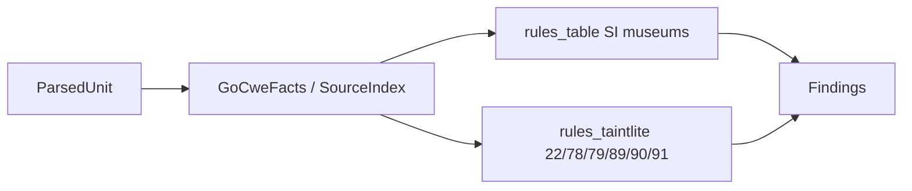

## Summary

Port Phase 7 CWE structural detectors for CodeHound Go: unified `GoCweScan` (PERF-style `RegisterRule` catalogue), SourceIndex fact bag, full **175/175** registry rule registration with generated metadata, structural SI/museum ports across all domain TOMLs, and taint-lite heuristics for CWE-22/78/79/89/90/91. Seed CWE-78/89 behaviour preserved; full inter-procedural taint remains Phase 9.

---

## Motivation / context

- Plans: `plans/port-phasewise-checklist.md` Phase 7
- Issue: #3
- Rust oracle: `codehound/src/lang/go/detectors/cwe/`
- Fixtures already present under `tests/fixtures/go/{stdlib,frameworks,taint}/`

---

## Changes

### CWE infrastructure

- `GoCweScan` unified detector with `RegisterRule` / `init` catalogue
- `GoCweFacts` + `cweNeedles` SourceIndex prefilter
- Generated catalogue metadata from `ruleset/golang/chunks/cwe-*.json`
- Plugin wiring: `detectors.All()` → `cwe.NewGoCweScan()` (+ PERF)

### Domain coverage (175 rules)

- Structural SI needle table (`rules_table.go`) for access_control, credentials, crypto, concurrency, configuration, deserialization, general_security, information_exposure, input_validation(+redos), file/network/request, injection residuals
- Taint-lite (`rules_taintlite.go`): CWE-22, 78, 79, 89, 90, 91
- Single-rule adapters `NewCWE78` / `NewCWE89` retained for seed unit tests

### Tests / docs

- `registry_test.go` — registration count, metadata, structural sample matrix, taint fixtures
- Updated `detectors/cwe/README.md` and Phase 7 checklist

---

## Impact

| Area | Impact |
|------|--------|
| **Performance** | One SourceIndex build per file; O(rules) cheap `Has` checks |
| **Memory** | Needle table ~hundreds of strings; per-file bool flags |
| **Behavior / correctness** | New CWE findings on scan; many rules fixture-shaped museums (parity with Rust trust freezes); confidence 0.55 table / 0.6–0.75 taint-lite |
| **API / CLI** | No CLI change; more rule IDs in `--list-rules` |
| **Dependencies** | None |
| **Binary size / build time** | Modest increase from metadata + table |

---

## Breaking changes / migration

| Item | Migration |
|------|-----------|
| None | — |

---

## Architecture notes



Full taint graph (Phase 9) will replace/augment taint-lite without changing `RegisterRule` wiring.

---

## Files changed (high level)

| Path | Change |
|------|--------|
| `internal/lang/go/detectors/cwe/*` | Infra, metadata, table rules, taint-lite, tests, README |
| `internal/lang/go/detectors/all.go` | `NewGoCweScan()` |
| `plans/port-phasewise-checklist.md` | Phase 7 checked |
| `plans/PR/pr-phase-7-cwe.md` | This PR body |

---

## Test plan

- [x] `go test ./...`
- [x] Focused: `go test ./internal/lang/go/detectors/cwe/ -count=1`
- [x] Seed CWE-78 / CWE-89 unit tests still pass
- [x] Structural sample fixtures (crypto, concurrency, injection residuals, …)
- [x] Taint fixtures for CWE-22/78/79/89

### Commands

```sh
go test ./...
go test ./internal/lang/go/detectors/cwe/ -count=1
```

---

## Related issues

- Closes #3

---

## PR metadata checklist (author)

- [x] Self-assigned (`--assignee @me`)
- [x] Labels applied (`enhancement`, `documentation`)
- [x] Related issues filled with real ticket IDs
- [x] Filled body committed under `plans/PR/pr-phase-7-cwe.md`

---

## Follow-ups (out of scope)

- Phase 9 full inter-procedural taint graph for 22/78/79/89/90/91
- Call-fact primary rewrites for high-signal structural rules (Rust trust promotions)
- Optional CI full 350-fixture CWE matrix
- Separate domain Go packages (currently single `cwe` package)

---

## Release notes (if user-facing)

feat(cwe): register all 175 structural CWE detectors with taint-lite seeds for core injection/path/XSS rules
