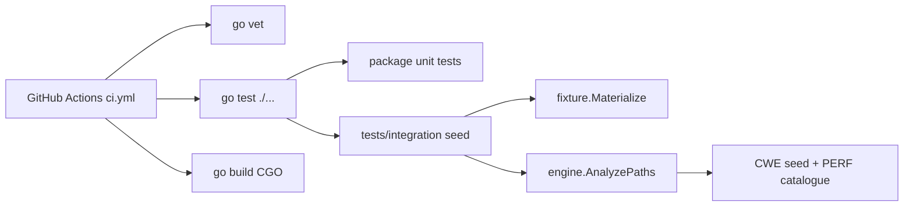

## Summary

Land **Phase 12 scaffolding only**: GitHub Actions CI (with CGO/tree-sitter toolchain), a seed materialized-fixture integration harness, profile/CLI contract tests, JSON/SARIF shape smoke tests, Makefile targets, multi-arch release notes stub, and a README status update. **§12.4 product parity baseline remains intentionally incomplete** until Phases 7-11 integrate.

---

## Motivation / context

- Plans: [`plans/port-phasewise-checklist.md`](../port-phasewise-checklist.md) §Phase 12, [`plans/phase-parallel/README.md`](../phase-parallel/README.md)
- Issue **#8** tracks full Phase 12 + the §12.4 ship gate (915 findings / export counts). This PR delivers the **unlocked subset** only.
- Full baseline needs export/cache/BP/taint surface from phases 7-11 - do not treat this PR as closing §12.4.

---

## Changes

### CI

- Add [`.github/workflows/ci.yml`](../../.github/workflows/ci.yml): `go vet`, `go test ./...`, `go build`, smoke `--version` / `--list-rules`
- Install `build-essential` and set `CGO_ENABLED=1` (tree-sitter requirement)

### Integration harness (seed)

- `tests/integration` package: materialize `.txt` fixtures → scan with default registry
- Seed fixture expectations: CWE-78/89 vulnerable+safe, PERF-6 vulnerable+safe
- Expand later; not the full fixture matrix

### Contract / schema tests

- `internal/cli/contract_test.go` - profiles, formats, only/skip CSV, defaults
- `internal/core/profile_contract_test.go` - fail policies, pack only-patterns, CLI union
- `internal/reporting/sarif_test.go` + JSON required-field smoke

### Docs / delivery

- Root `README.md` - install (CGO), usage, port status table, Makefile targets
- `Makefile` - `integration`, `ci`, `version`; document `CGO_ENABLED`
- `.goreleaser.stub.yml` - multi-arch / CGO release notes (not wired)
- Checklist §12.1-12.2 partial checkboxes with evidence; §12.4 untouched as open gate

---

## Code snippets (if applicable)

### CI CGO note

```yaml
- name: Install C build toolchain (CGO / tree-sitter)
  run: |
    sudo apt-get update
    sudo apt-get install -y --no-install-recommends build-essential
```

### Seed harness usage

```go
res, err := integration.MaterializeAndScan(integration.Case{
    RelPath: "go/taint/CWE-78-vulnerable.txt",
    RuleID:  "CWE-78",
    ExpectFire: true,
}, t.TempDir())
```

---

## Impact

| Area | Impact |
|------|--------|
| **Performance** | None product-side; CI runs full `go test ./...` |
| **Memory** | N/A |
| **Behavior / correctness** | No detector logic changes; new tests only |
| **API / CLI** | Unchanged |
| **Dependencies** | None new; CGO already required |
| **Binary size / build time** | CI job adds apt + CGO build (~same as local) |

---

## Breaking changes / migration

| Item | Migration |
|------|-----------|
| None | - |

---

## Architecture notes



---

## Files changed (high level)

| Path | Change |
|------|--------|
| `.github/workflows/ci.yml` | New CI workflow |
| `tests/integration/*` | Harness + seed fixture expectations tests |
| `internal/cli/contract_test.go` | CLI contract tests |
| `internal/core/profile_contract_test.go` | Profile contract tests |
| `internal/reporting/sarif_test.go` | SARIF/JSON shape smoke |
| `Makefile` | `ci`, `integration`, `version`, CGO |
| `README.md` | Install / usage / port status |
| `.goreleaser.stub.yml` | Multi-arch stub notes |
| `plans/port-phasewise-checklist.md` | Phase 12 partial checkboxes |
| `plans/PR/pr-phase-12-ci.md` | This PR record |

---

## Test plan

- [x] `go test ./...` (CGO_ENABLED=1)
- [x] `go test ./tests/integration/...`
- [x] `go vet ./...`
- [x] `go build -o bin/goslop ./cmd/goslop`
- [ ] CI green on the opened PR (workflow path `.github/workflows/ci.yml`)
- [ ] Confirm §12.4 checkboxes remain **unchecked** in the checklist

### Commands

```sh
CGO_ENABLED=1 go test ./...
CGO_ENABLED=1 go vet ./...
CGO_ENABLED=1 go build -o bin/goslop ./cmd/goslop
make ci
```

---

## Screenshots / sample output

```
$ CGO_ENABLED=1 go test ./...
ok  github.com/chinmay-sawant/goslop/tests/integration   0.008s
# ... all packages PASS
```

---

## Related issues

- Relates to #8
- Relates to #2
- Refs #3
- Refs #4
- Refs #5
- Refs #6
- Refs #7

---

## PR metadata checklist (author)

- [x] Self-assigned (`--assignee @me`)
- [x] Labels applied (`enhancement`, `documentation`)
- [x] Related issues filled with real ticket IDs (**Relates to #8**, not Closes)
- [x] Filled body committed under `plans/PR/pr-phase-12-ci.md`

---

## Follow-ups (out of scope)

- **§12.4 ship gate** - 915 findings / severity histogram / top rules / 915+37 exports on reference corpus
- Full materialized fixture matrix as CI gate
- Perf smoke budgets
- GoReleaser release job (stub only)
- Phases 7-11 detector/cache/pack work that unblocks the parity baseline

---

## Reviewer checklist

- [ ] Behavior matches summary and test plan
- [ ] No unrelated changes in diff
- [ ] PR does **not** claim §12.4 complete or use `Closes #8`
- [ ] CI workflow installs C toolchain for tree-sitter
- [ ] PR has assignee and labels
- [ ] Related issues use **Relates to #8**
- [ ] No secrets or generated artifacts committed

---

## Release notes (if user-facing)

CI workflow and integration-test scaffolding for the goslop Go port (Phase 12 partial). Product parity baseline (§12.4) still pending.
