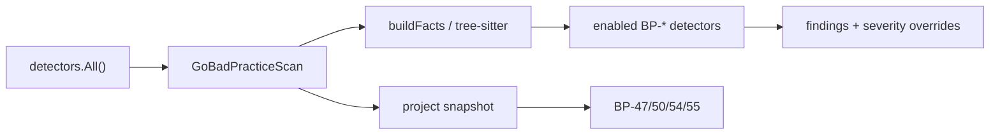

## Summary

Ports Phase 8 Go bad-practice (BP) detectors into goslop Go: unified `GoBadPracticeScan` runner with per-rule enable and severity override, **127** heuristic BP rule modules (priority **BP-1** / **BP-5**), project-level server-policy rules (BP-47/50/54/55), and recommended-profile parity (BP off by default).

---

## Motivation / context

- Plans: `plans/port-phasewise-checklist.md` (Phase 8), `plans/parity-matrix.md`
- Rust reference: `goslop/src/lang/go/detectors/bad_practices/`
- Ruleset: `ruleset/golang/bad-practices.json` (135 catalogue entries)
- Issues: see **Related issues**

---

## Changes

### BP detector package (`internal/lang/go/detectors/bad_practices/`)

- `GoBadPracticeScan` - one Detector, many rules; `ctx.Allows` gating; `ApplyFindingOverrides` for BP severity override
- Metadata catalogue generated from `bad-practices.json` (135 IDs)
- Shared tree-sitter/source facts + project snapshot caches
- Rule domains: error handling, concurrency, testing, API/style, production hardening, resources/DB, HTTP frameworks, dependency hygiene
- **127** `RegisterRule` detectors (heuristic ports of Rust modules)

### Project-level rules

- Server anchors: **BP-47**, **BP-50**, **BP-54**, **BP-55** (once per server entrypoint)
- Module anchors: **BP-57**…**BP-65** (go.mod heuristics; several stubs)

### Wiring / profile

- Registered in `detectors.All()`
- `ProfileRecommended` keeps `BadPracticesEnabled=false` (existing `profile.go` parity)
- Style / all profiles enable `BP-*`

### Docs / checklist

- Phase 8 checklist items marked done
- BP package README updated
- Parity matrix BP row updated

### Tests

- Vulnerable fires / safe silent for key fixtures (BP-1, BP-5, and many others)
- Project fixtures for BP-47 / BP-50
- Severity override + recommended-profile BP-off assertions

---

## Impact

| Area | Impact |
|------|--------|
| **Performance** | BP facts built once per file when any BP rule is enabled; tree-sitter parse on demand |
| **Memory** | Project snapshot memoized per scan root |
| **Behavior / correctness** | New BP findings under `style` / `all` / explicit `--only BP-*`; recommended CI pack unchanged |
| **API / CLI** | No CLI flag changes; uses existing profile / only / skip |
| **Dependencies** | None new |
| **Binary size / build time** | Modest growth from BP package |

---

## Breaking changes / migration

| Item | Migration |
|------|-----------|
| None | - |

---

## Architecture notes



---

## Files changed (high level)

| Path | Change |
|------|--------|
| `internal/lang/go/detectors/bad_practices/*` | New runner, rules, tests, README |
| `internal/lang/go/detectors/all.go` | Register BP scan |
| `plans/port-phasewise-checklist.md` | Phase 8 checked |
| `plans/parity-matrix.md` | BP row |
| `plans/PR/pr-phase-8-bp.md` | This PR body |

---

## Test plan

- [x] `go test ./...` PASS
- [x] Focused BP fixture tests (vulnerable fire / safe silent)
- [x] Project BP-47/50 fixtures
- [x] Recommended profile keeps BP off

### Commands

```sh
go test ./internal/lang/go/detectors/bad_practices/ -count=1
go test ./... -count=1
```

---

## Related issues

- Closes #4

---

## PR metadata checklist (author)

- [x] Self-assigned (`--assignee @me`)
- [x] Labels applied (`enhancement`, `documentation`)
- [x] Related issues filled with real ticket IDs
- [x] Filled body committed under `plans/PR/pr-phase-8-bp.md`

---

## Follow-ups (out of scope)

- AST-precise parity for remaining catalogue IDs not yet registered (~8) or weak stubs (BP-59/61/62/63)
- Full fixture matrix for all 384 BP text fixtures
- CVE/advisory-backed BP-63
- Prewarm hook from engine `PrepareProject` (caches already work on first project rule hit)

---

## Reviewer checklist

- [ ] Behavior matches summary and test plan
- [ ] No unrelated changes in diff
- [ ] New rules have fixture coverage for priority IDs
- [ ] PR has assignee and labels
- [ ] Related issues use correct Closes/Relates keywords
- [ ] No secrets or generated artifacts committed

---

## Release notes (if user-facing)

- Go bad-practice (BP) detectors: enable via profile `style` / `all` or `--only BP-*`; recommended pack remains BP-off.
