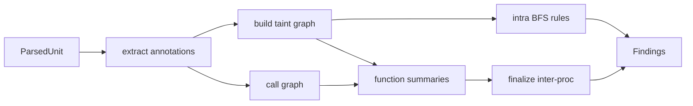

## Summary

Adds experimental intra- and inter-procedural taint tracking for Go CWE-22/78/79/89, gated by `--taint` / security profile. Seed CWE-78/89 heuristics remain the fallback when taint is off. Name-string model honesty is preserved (triage aid, not a security gate).

---

## Motivation / context

- Plans: `plans/port-phasewise-checklist.md` Phase 9, `documents/taint.md`
- Rust reference: `goslop/src/lang/go/detectors/cwe/taint/`
- Issues: see **Related issues**

Phase 9 is unlocked by seed CWE detectors + existing taint fixtures; full structural CWE (Phase 7) is a parallel PR and is not required.

---

## Changes

### Taint engine (`internal/lang/go/detectors/cwe/taint/`)

- **Extract** - tree-sitter walk for sources, sinks, sanitizers, assignments, scopes, channel staging (G5 v0 pairing)
- **Classify** - name-string tables for UserInput/Args/Env/File/Network sources; CommandExec/SQL/FileOpen/Template/HTTPWrite sinks; Path/HTML/Validation sanitizers (`filepath.Clean` is **not** a path sanitizer)
- **Graph build** - versioned last-write variables, assignment/argument edges, known propagators, opaque-call skip
- **Query** - BFS with sanitizer-state tracking
- **Summaries + multihop** - per-function param/return/sink summaries; `taint_max_depth` 1-4 same-package refinement
- **Inter-procedural finalize** - same-package call-site resolution (package identity + receiver keys; decline ambiguous method names)
- **Rules** - CWE-22, CWE-78, CWE-79, CWE-89

### Integration

- CLI: `--taint`, `--no-taint`, `--taint-depth N`, `--taint-show-paths`
- `ScanContext.TaintEnabled` / `TaintMaxDepth` / `TaintShowPaths`; security profile enables taint with depth 4
- Seed CWE-78/89 detectors skip when taint is on (no double findings)
- `RequiresCacheState` true when taint enabled (Phase 10 warm-hit hook)
- Metadata for CWE-22 and CWE-79

### Tests

- All `tests/fixtures/go/taint/*.txt` (IP-010 vulnerable quarantined as honest FN)
- `taint_projects/` multi-file same-package resolution cases

---

## Impact

| Area | Impact |
|------|--------|
| **Performance** | Taint off by default under recommended; extract+BFS only when enabled |
| **Memory** | Per-file graphs accumulated for finalize when taint on |
| **Behavior / correctness** | New findings for CWE-22/79; richer CWE-78/89 when `--taint` |
| **API / CLI** | New flags; config `[goslop.taint]` stub deferred |
| **Dependencies** | None new (tree-sitter already present) |

---

## Breaking changes / migration

| Item | Migration |
|------|-----------|
| None | Seed CWE-78/89 still run when taint is off |

---

## Architecture notes



---

## Files changed (high level)

| Path | Change |
|------|--------|
| `internal/lang/go/detectors/cwe/taint/*` | New taint package |
| `internal/lang/go/detectors/all.go` | Register taint detector |
| `internal/lang/go/detectors/cwe/{cwe78,cwe89,metadata}.go` | Gate seeds; Meta CWE-22/79 |
| `internal/core/context.go`, `profile.go` | Taint fields / security defaults |
| `internal/cli/*`, `internal/app/run.go` | CLI flags + wiring |
| `plans/port-phasewise-checklist.md` | Phase 9 checked off |

---

## Test plan

- [x] `go test ./...`
- [x] Focused: `go test ./internal/lang/go/detectors/cwe/taint/ -v`
- [x] Fixture baseline: vulnerable fires / safe silent; IP-010 quarantined
- [x] Multi-file `taint_projects/` resolution

### Commands

```sh
go test ./...
go test ./internal/lang/go/detectors/cwe/taint/ -count=1 -v
```

---

## Related issues

- Closes #5

---

## PR metadata checklist (author)

- [x] Self-assigned (`--assignee @me`)
- [x] Labels applied (`enhancement`, `documentation`)
- [x] Related issues filled with real ticket IDs
- [x] Filled body committed under `plans/PR/pr-phase-9-taint.md`

---

## Follow-ups (out of scope)

- Config table `[goslop.taint]` full load (schema already documents keys)
- CWE-90/91 taint rules
- Full import-path cross-package resolution
- Channel/goroutine concurrent model (IP-010 remains FN)
- Text/JSON reporter pretty-print for `TaintFlow` evidence when `--taint-show-paths`

---

## Release notes (if user-facing)

Experimental taint tracking for CWE-22/78/79/89 via `--taint` or `--profile security`.
