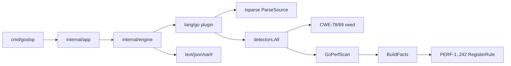

## Summary

Land the goslop Go port foundation (Phases 0-5) and complete Phase 6 by registering the full PERF registry (**239/239** rules) behind a unified `GoPerfScan`, so the product can list and run the entire performance catalogue.

---

## Motivation / context

- Plans: [`plans/port-phasewise-checklist.md`](../port-phasewise-checklist.md), [`plans/architecture-go.md`](../architecture-go.md), [`plans/parity-matrix.md`](../parity-matrix.md)
- Batch manifests: [`plans/perf-batches/`](../perf-batches/)
- Issues: see **Related issues**
- Parent product: Rust goslop (`../goslop`); this repo is the Go reimplementation (`goslop`)

---

## Changes

### Core / engine (Phases 0-5)

- Bootstrap module layout: `cmd/goslop`, `internal/*`, fixtures, ruleset, plans
- Core contracts: findings, fingerprint v2, profiles, Detector / LanguagePlugin
- Fixture materializer + tree-sitter Go parse path (`tsparse`, SourceIndex, AST walk)
- Engine: file walk, registry, parallel analyzer lifecycle
- CLI / app: profiles, only/skip, formats, list-rules, init, exit codes
- Reporters: text, JSON, SARIF 2.1.0

### PERF detectors (Phase 6)

- Unified `GoPerfScan` with `GoPerfFacts` (calls, assignments, conversions, defer/go/for)
- Hot-path / handler-shaped / loop helpers
- `RegisterRule` + `init()` batch registration for parallel landings
- Go plugin `ParseSource` attaches CST; engine closes trees after scan
- Seed rules: PERF-1…8, 32, 50, 116, 230
- Five batches covering remaining registry rows (239 total)

| Batch | Range (approx) | Count |
|------:|----------------|------:|
| Seed | 1-8, 32, 50, 116, 230 | 12 |
| 1 | PERF-9…60 | 50 |
| 2 | PERF-61…111 | 50 |
| 3 | PERF-112…163 | 50 |
| 4 | PERF-164…214 | 50 |
| 5 | PERF-215…242 | 27 |
| **Total** | registry complete | **239** |

### Plans / docs

- Checklist and parity matrix updated for Phase 6 closure
- PERF batch manifests under `plans/perf-batches/`
- This PR record under `plans/PR/`

---

## Code snippets (if applicable)

### After - unified PERF dispatch

```go
// GoPerfScan builds facts once, then runs every allowed PERF rule.
facts := BuildFacts(unit)
for _, e := range rulesCopy {
    if ctx != nil && !ctx.Allows(e.id) {
        continue
    }
    e.fn(unit, facts, out)
}
```

### After - batch registration

```go
func init() {
    RegisterRule("PERF-61", detectPERF61, &MetaPERF61)
    // ...
}
```

---

## Impact

| Area | Impact |
|------|--------|
| **Performance** | Facts built once per file; tree-sitter parse cost for Go units; parallel file workers unchanged |
| **Memory** | Per-file CST + fact bag; trees closed after each file scan |
| **Behavior / correctness** | Full PERF catalogue runnable; heuristics may FN/FP vs Rust until polish |
| **API / CLI** | `--list-rules` now includes 239 PERF + seed CWE rules |
| **Dependencies** | tree-sitter Go (CGO) required for accurate loop/call facts |
| **Binary size / build time** | Larger detector surface; CGO build required |

---

## Breaking changes / migration

| Item | Migration |
|------|-----------|
| None | Greenfield Go port; no prior released Go binary contract |

---

## Architecture notes



---

## Files changed (high level)

| Path | Change |
|------|--------|
| `internal/lang/go/detectors/perf/*` | PERF infra + 239-rule catalogue (batches 1-5) |
| `internal/lang/go/plugin.go` | tree-sitter `ParseSource` |
| `internal/engine/analyzer.go` | close unit trees after scan |
| `internal/lang/go/detectors/all.go` | wire `NewGoPerfScan` |
| `plans/port-phasewise-checklist.md` | Phase 6 status |
| `plans/parity-matrix.md` | PERF 239/239 |
| `plans/perf-batches/` | batch manifests |
| `plans/PR/pr-phases-0-6-perf.md` | this PR record |

---

## Test plan

- [x] `go test ./...`
- [x] `go build -o bin/goslop ./cmd/goslop`
- [x] Focused PERF package tests (seed + batch samples)
- [x] Manual: `--list-rules` shows 241 lines (239 PERF + 2 CWE)
- [x] Manual: `--only PERF-6` fires on loop `fmt.Sprintf` sample
- [ ] Optional: full 490 PERF fixture matrix as CI gate
- [ ] Optional: FN/FP spot-check vs Rust reference corpus

### Commands

```sh
go test ./...
go build -o bin/goslop ./cmd/goslop
./bin/goslop --list-rules | wc -l
./bin/goslop --profile all --only PERF-6 .
```

---

## Screenshots / sample output

```
$ ./bin/goslop --list-rules | wc -l
241

$ ./bin/goslop --profile all --only PERF-6 /tmp/perf6_sample.go
PERF-6 /tmp/perf6_sample.go:6:21 fmt-based formatting is performed inside a loop body
```

---

## Related issues

- Closes #2
- Relates to #9
- Refs #3
- Refs #4
- Refs #5
- Refs #6
- Refs #7
- Refs #8

---

## PR metadata checklist (author)

- [x] Self-assigned (`--assignee @me`)
- [x] Labels applied (`enhancement`, `documentation`)
- [x] Related issues filled with real ticket IDs
- [x] Filled body committed under `plans/PR/pr-phases-0-6-perf.md`

---

## Follow-ups (out of scope)

- Residual Phase 0-5: `goslop.toml` load, `--export-context` / `--export-chunks`, `--explain`, gitignore walk (#9)
- Phase 6 polish: expand `perfNeedles`, residual FN/FP vs Rust (#2 follow-up comments)
- Phase 7 CWE structural domains beyond CWE-78/89 seed (#3)
- Phase 8 BP detectors (#4)
- Phase 9 taint graph (#5)
- Phase 10 cache / baseline / ignore (#6)
- Phase 11 packs / maturity (#7)
- Phase 12 parity gates + §12.4 parity baseline (915 findings / exports) (#8)

---

## Reviewer checklist

- [ ] Behavior matches summary and test plan
- [ ] No unrelated changes in diff
- [ ] Public API / CLI changes documented
- [ ] New rules have fixture coverage samples in tests / `tests/fixtures/`
- [ ] PR has assignee and labels
- [ ] Related issues use correct Closes/Relates keywords
- [ ] Architecture notes accurate for Go port
- [ ] No secrets or generated artifacts committed (`scripts/findings`, `bin/` ignored)

---

## Release notes (if user-facing)

Go port of goslop: MVP CLI/engine plus full 239-rule PERF catalogue (heuristic parity with Rust registries).
